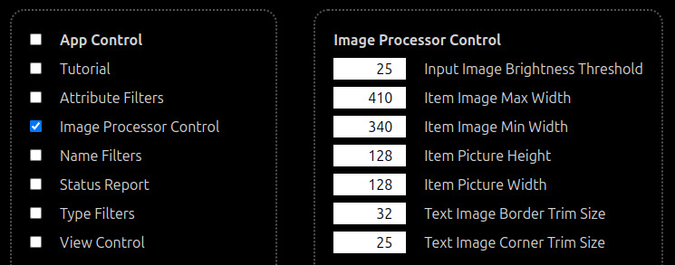
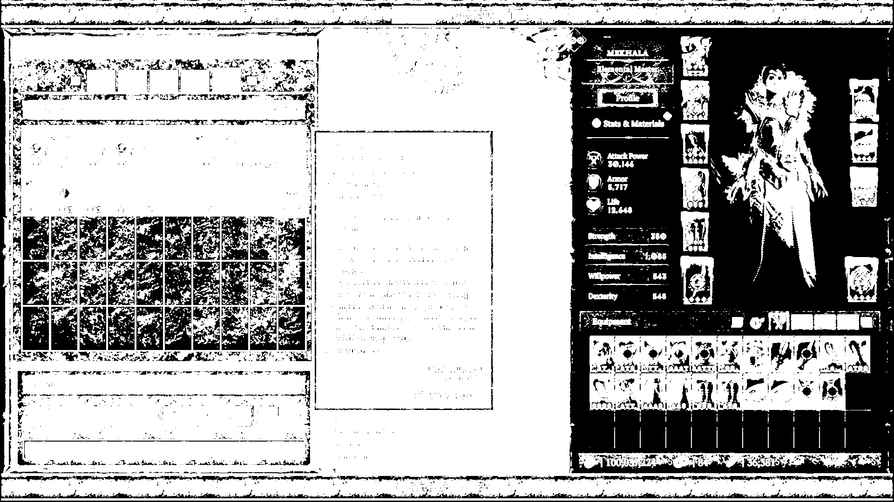
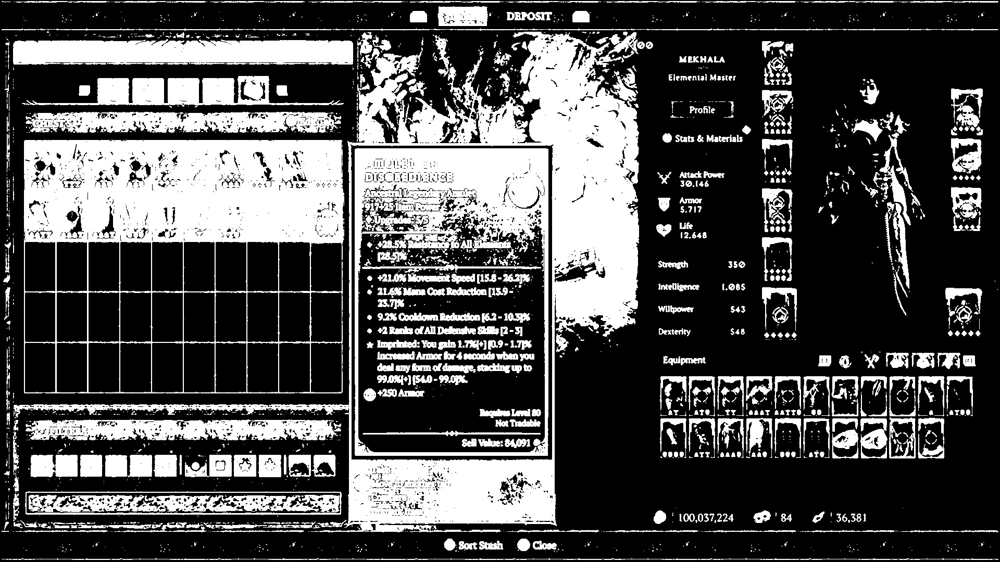
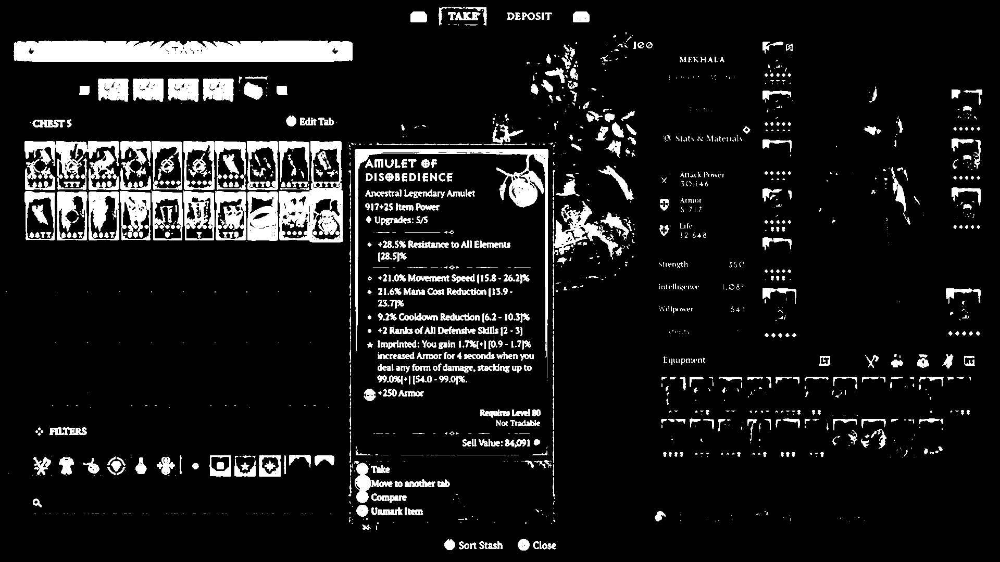
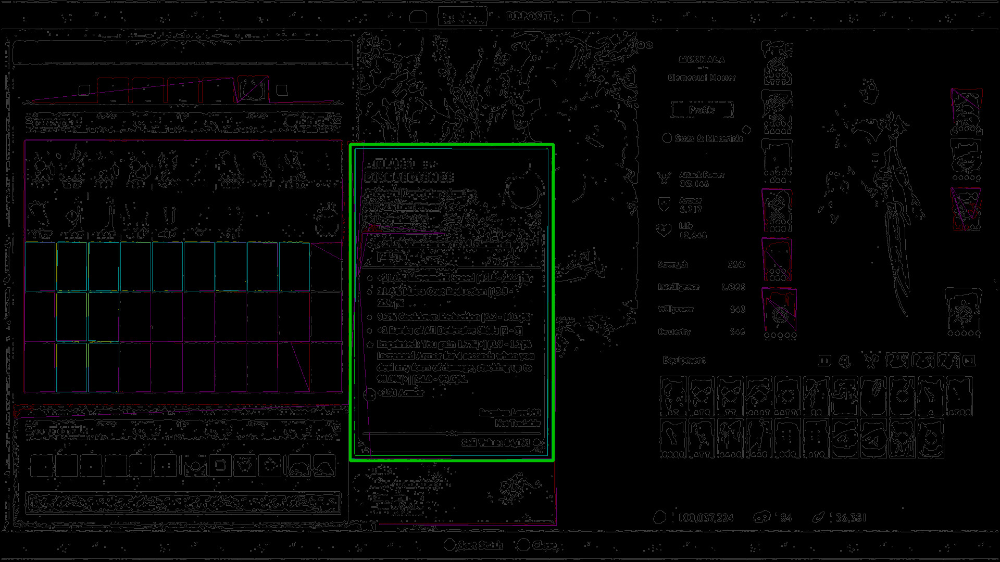
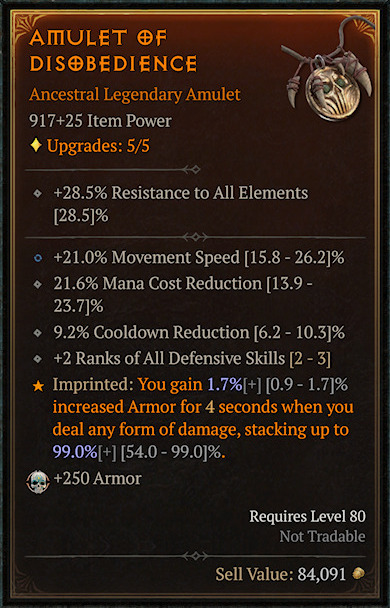

D4pi runs its input images thru several processing steps to extract
useful information.

Take this screenshot as an example:

It was taken under the following conditions:

* 1080p (**1920*1080**)
* Diablo4: GAMEPLAY: **Advanced Tooltip Information: Enabled**
* Diablo4: GRAPHICS: **Brightness: Default**
* Diablo4: GRAPHICS: **Font Scale: Small**
* **Xbox Series X**

In its original form, this example screenshot contains way more than the
game item tooltip window.

# Image Processor Control

All image processing settings mentioned in this document can be adjusted
thru the **Image Processor Control**:

This document is based on D4pi `202401291613`.

# Input Image Brightness Threshold

The first step is to make all rectangular shapes stand out.

The following images are what the example screenshot looks like after
being processed with various **Brightness Threshold** values.

## Input Image Brightness Threshold: 10

The game item tooltip window's border edges are thin, broken lines.
This is not ideal.

## Input Image Brightness Threshold: 25

This is the default setting.  The game item tooltip window's border
edges are thick, continuous lines.  This is desired.

## Input Image Brightness Threshold: 50

The game item tooltip window's border edges are not distinguishable from
its background and neighboring elements.  This is not ideal.

# Item Image Max & Min Width

The second step is to filter out rectangular shapes that are too wide or
too narrow.

The following image is what the example screenshot looks like after
being processed with the default **Max Width** (410) and **Min Width**
(340) settings.

Among all rectangular shapes, the best candidate for the game item
tooltip window is marked with thick, green lines.

And then the game item image is extracted from the example screenshot.

# Item Picture Height & Width; Text Image Border & Corner Trim Size

The last step is to remove noises from the extracted game item image.

* The **Item Picture** at the top-right corner
* The **Border** (all edges and the top-left **Corner**)

The following image is what the item image looks like after being
processed with the default settings:

* **Item Picture Height**: 128
* **Item Picture Width**: 128
* **Text Image Border Trim Size**: 32
* **Text Image Corner Trim Size**: 25

Now it is ready to be passed onto D4pi's game item tooltip text
processor.
